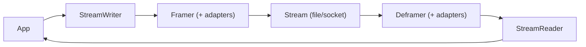
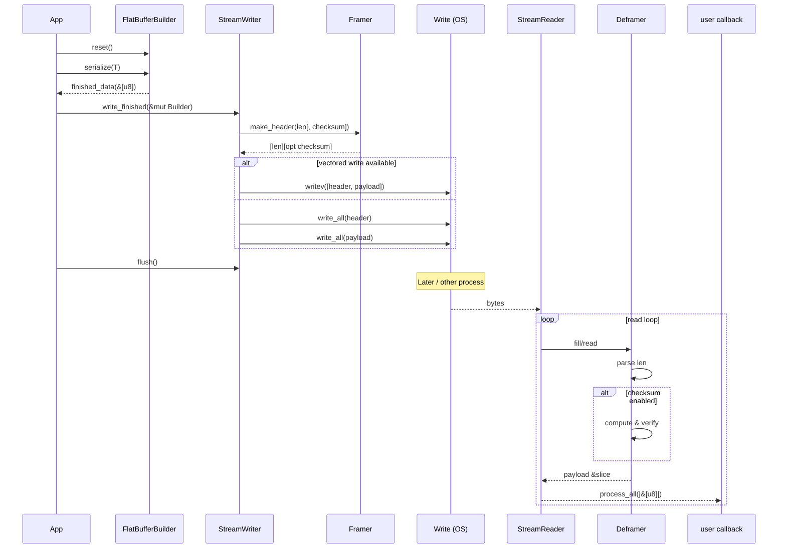

# FlatStream

[](https://github.com/dallasmarlow/flatstream-rs/actions/workflows/rust.yml)
[](https://crates.io/crates/flatstream)
[](https://docs.rs/flatstream)

A lightweight, zero-copy oriented, high-performance Rust library for encoding and decoding sequences of framed FlatBuffers messages.

FlatStream provides a trait-based architecture for efficiently writing and reading streams of FlatBuffers messages with a focus on maintaining zero-copy behavior. It originated from a high-frequency telemetry capture agent and has evolved into a general-purpose library for high-throughput, low-latency applications that need durable, replayable streams and predictable performance characteristics.

FlatStream is a small framing layer that adds stream boundaries and optional integrity to ordinary (non–size-prefixed) FlatBuffer payloads. Each frame is: 4-byte little-endian payload length, optional checksum, then payload bytes. The library does not change how FlatBuffers are encoded; it provides ergonomic streaming APIs (e.g., zero-copy reading via process_all()/messages()), bounded reads, and composable adapters (checksums, bounds, observers). It integrates cleanly with standard Rust Read/Write and can be used over network transports (e.g., TCP), but networking has not been the primary focus of development or testing.

    Note on Performance: The performance figures and experimental results cited in the documentation were generated on a modern ARM-based MacBook Pro. Actual performance will vary based on the specific hardware and workload.

## TL;DR

FlatStream is a small framing layer around FlatBuffers for streams (files/sockets). It writes and reads sequences of messages with a minimal header and optional checksums, while preserving zero-copy access to each FlatBuffer payload as a `&[u8]`.

## Wire format (at a glance)

```
[4-byte LE: payload length (u32)] [N-byte checksum (optional)] [FlatBuffer payload...]
```

- **checksum N**: 0, 2, 4, or 8 bytes depending on configured algorithm.
- The payload is a normal FlatBuffer (not FlatBuffers’ internal size-prefixed variant).

## When to use / when not to use

- **Use FlatStream when**:
  - You need to write/read many FlatBuffers messages to a file or socket.
  - You want zero-copy access to message payloads as `&[u8]`.
  - You want composable adapters (bounds, checksums, observers) without extra allocations.

- **Probably not a fit when**:
  - You need a full RPC protocol, service discovery, or schema negotiation.
  - You require text/binary interop outside of FlatBuffers.

## Minimal end-to-end example

```rust
use flatbuffers::FlatBufferBuilder;
use flatstream::{DefaultDeframer, DefaultFramer, StreamReader, StreamWriter, Result};
use std::io::{BufReader, BufWriter, Cursor};

fn main() -> Result<()> {
    // Write one message
    let mut bytes = Vec::new();
    {
        let writer = BufWriter::new(Cursor::new(&mut bytes));
        let mut stream = StreamWriter::new(writer, DefaultFramer);
        let mut b = FlatBufferBuilder::new();
        let s = b.create_string("hello flatstream");
        b.finish(s, None);
        stream.write_finished(&mut b)?;
        stream.flush()?;
    }

    // Read it back (payload provided as &[_])
    let reader = BufReader::new(Cursor::new(bytes));
    let mut stream = StreamReader::new(reader, DefaultDeframer);
    stream.process_all(|payload| {
        println!("payload bytes: {}", payload.len());
        Ok(())
    })
}
```

## Architecture at a glance





```
   StreamWriter             Framer (+ adapters)                 Stream
        |                         |                          [len][opt checksum][payload] ...
        v                         v                                   |
    FlatBuffer  --->  [len][checksum][payload]  --->  write            v

    read          <---  [len][checksum][payload]  <---  Deframer (+ adapters)  <---  StreamReader
                                      |
                                      v
                               payload: &[u8] (zero-copy)
```

## Core concepts (cheat sheet)

| Concept | What it is |
|---|---|
| `StreamWriter<W, F>` | Writes messages using a `Framer` to a `Write` impl |
| `StreamReader<R, D>` | Reads messages using a `Deframer` from a `Read` impl (yields `&[u8]`) |
| `Framer` | Defines how to encode `[len][opt checksum][payload]` |
| `Deframer` | Defines how to decode `[len][opt checksum][payload]` |
| `Checksum` | Pluggable integrity algorithm (e.g., `xxhash64`, `crc32`, `crc16`) |
| `Bounded*` adapters | Enforce max payload size on read/write |
| `Observer*` adapters | Invoke user callback with `&[u8]` slice (no allocation) |

## FAQ

- **Why not use FlatBuffers’ size-prefixed buffers?**
  - FlatStream already prefixes at the stream layer. Adding another 4-byte prefix inside the payload is redundant. Use `flatbuffers::root`/`root_with_opts` on the payload.

- **Is this zero-copy?**
  - Yes. The reader’s `process_all()`/`messages()` provide `&[u8]` borrowed from the internal buffer. No intermediate copies are introduced by adapters.

- **How do I stop early?**
  - Use `messages()` and `break`, or return an `Err` from the `process_all` closure to halt. A lightweight “stop” enum could be added in the future.

- **Does this replace a protocol?**
  - No. It’s a framing layer for FlatBuffers payloads. RPC/routing/etc. are out of scope.

## Why FlatStream?

While FlatBuffers provides an efficient zero-copy serialization format, it does not specify a protocol or offer utilities for common streaming use cases. This typically requires developers to create custom solutions for message framing, memory management, and data integrity when writing sequences of messages.

Such recurring implementations can be inconsistent and may fail to adhere to zero-copy principles or leverage the most performant patterns of the FlatBuffers API.

### Origin

FlatStream was developed as a solution for a foundational use case: a high-frequency telemetry capture agent that required a durable, replayable stream format with minimal overhead. This application required capturing wide frames of mixed data types at sub-millisecond intervals, and FlatBuffers was selected for its efficiency and cross-platform compatibility.

The library's current architecture is the direct result of the performance-driven refactoring and experimentation required to optimize for this initial scenario. It encapsulates these validated, high-performance patterns into a general-purpose and composable library that provides a standardized framing layer for FlatBuffers in Rust.

## Architecture and Design Principles

FlatStream is designed around composability and zero-cost abstractions to solve common streaming challenges with a focus on zero-copy behaivor and performance.

### Composability and Static Dispatch

The library utilizes a trait-based Strategy Pattern to separate concerns:

- ***StreamSerialize:*** Defines how user data is serialized into the FlatBufferBuilder.
- ***Framer / Deframer:*** Defines the wire/file format (e.g., DefaultFramer or ChecksumFramer).
- ***Checksum:*** Defines the algorithm used for data integrity (e.g., XxHash64, Crc32).

The core types (StreamWriter/StreamReader) are generic over these traits. This allows the Rust compiler to use monomorphization, resulting in static dispatch in many cases and avoiding the overhead of dynamic dispatch (vtable lookups) on the critical path.


### Performance: Zero-Copy Throughout

Performance is achieved by maintaining the FlatBuffers zero-copy philosophy at every level.

- ***Zero-Copy Writing:*** Both simple and expert modes are zero-copy. After serialization, builder.finished_data() returns a direct slice that is written to I/O without any intermediate copies.
- ***Zero-Copy Reading:*** The StreamReader provides true zero-copy access through its process_all() and messages() APIs, which deliver borrowed slices (&[u8]) directly from the internal read buffer.

FlatStream solves common streaming challenges by adhering to a few core principles:

- ***Composability and Static Dispatch:*** The library is built on a trait-based Strategy Pattern (Framer, Deframer, Checksum). This allows the Rust compiler to use monomorphization to create specialized, optimized code for your specific configuration, eliminating runtime overhead.

- ***Zero-Copy by Default:*** The library is designed to maintain FlatBuffers' zero-copy philosophy. The StreamReader provides true zero-copy access to data via borrowed slices (&[u8]), eliminating memory allocations and copies on the read path.

- ***Pragmatic Performance:*** The StreamWriter offers two modes: a simple, convenient API for common use cases, and an expert-level API that provides fine-grained control over the FlatBufferBuilder lifecycle. This allows developers to avoid common performance pitfalls like memory bloat when dealing with mixed message sizes.

## Architecture and Design Principles

The library is designed around composability and zero-cost abstractions to maximize performance in demanding and/or resource constrained environments.

### Performance: Zero-Copy Throughout

Performance is achieved through maintaining FlatBuffers' zero-copy philosophy at every level.

- **Zero-Copy Writing (Both Modes)**: Both simple and expert modes maintain perfect zero-copy behavior. After serialization, `builder.finished_data()` returns a direct slice that's written to I/O without any intermediate copies. The performance differences between modes come mostly from trait dispatch overhead (~0.9ns per operation in simple mode) and memory management flexibility, not from data copying.
- **Zero-Copy Reading**: `StreamReader` provides true zero-copy access through `process_all()` and `messages()` APIs. These deliver borrowed slices (`&[u8]`) directly from the read buffer - no allocations, no copies.
- **FlatBuffers Philosophy**: The serialized format IS the wire format, and in some cases a suitable final storage format. Unlike the proposed v2.5 design with its batching and type erasure, the current implementation maintains direct buffer-to-I/O paths and a convenience writer method with optimized, but not ultimate performance.
- **Benchmarking and Practical Testing**: Benchmarks and experimental script tests are used to validate design choices and influence the development of the library with feature-gated criterion benchmarks for all library configurations. Real-world performance often exceeds documented benchmarks, with throughput tests consistently resulting in 15+ million messages/sec throughput on a modern macbook pro.

### Composability and Static Dispatch

The library utilizes a trait-based Strategy Pattern to separate concerns:

- **`StreamSerialize`**: Defines how user data is serialized into the FlatBufferBuilder.
- **`Framer` / `Deframer`**: Defines the wire/file format (e.g., `DefaultFramer` or `ChecksumFramer`).
- **`Checksum`**: Defines the algorithm used for data integrity (e.g., `XxHash64`, `Crc32`).

The core types (`StreamWriter`/`StreamReader`) are generic over these traits. This allows the Rust compiler to use monomorphization, resulting in static dispatch and eliminating the overhead of dynamic dispatch (vtable lookups) on the critical path.

## Writing Modes: Simple vs Expert

FlatStream provides two modes for writing data, allowing you to choose based on your performance requirements:

### Simple Mode - Internal FlatBuffers Builder (Default)
Best for: Convenience, smaller number of messages per-stream and uniform/consistent message sizes

```rust
let mut writer = StreamWriter::new(file, DefaultFramer);
writer.write(&"Hello, world!")?;  // Internal builder management
```

- **Pros**: Zero configuration, automatic optimized builder reuse to avoid unnecessary heap allcoations and memory copy operations, easy to use
- **Cons**: Single internal builder can cause memory bloat with mixed sizes due to the FlatBuffers default grow-downward allocator behaivor
- **Performance**: Excellent for uniform messages (within 0-25% of expert mode)

### Expert Mode - Self Managed FlatBuffers Builder(s)
Best for: Mixed message sizes, large messages, memory-constrained systems

```rust
let mut builder = FlatBufferBuilder::new();
let mut writer = StreamWriter::new(file, DefaultFramer);

// Self managed builder for zero-allocation writes
builder.reset();
event.serialize(&mut builder)?;
writer.write_finished(&mut builder)?;
```

- **Pros**: Multiple builders for different message types or size groups, better memory control, better performance for larger streams in length and message size
- **Cons**: More verbose, requires understanding of FlatBuffers
- **Performance**: Greater performance potential through improved memory control

> **📊 Zero-Copy Note**: Both simple and expert modes maintain perfect zero-copy behavior - data is never copied after serialization. Expert mode is recommended when you need multiple builders for different message sizes to avoid memory bloat, not because it's "more zero-copy."

### Understanding the Real Differences

The key differences between simple and expert mode are **NOT** about zero-copy (both are equally zero-copy):

1. **Memory Flexibility**: Expert mode allows multiple builders for different message sizes
2. **Performance with Large Messages**: Less trait dispatch overhead (can be verifiably faster)
3. **Memory Efficiency**: Avoid builder bloat when mixing large and small messages
4. **Builder Lifecycle Control**: Drop and recreate builders as needed for rare large messages

The performance overhead in simple mode (0-25%, or ~0.9ns per operation) comes from trait dispatch through the `StreamSerialize` trait, not from copying data. Expert mode avoids this trait dispatch by calling `write_finished()` directly with pre-serialized data.

## Installation

Add `flatstream` and the `flatbuffers` dependency to your `Cargo.toml`:

```toml
[dependencies]
flatbuffers = "24.3.25" # Use the appropriate version
flatstream = "0.2.6"
```

### Feature Flags

Data integrity checks (checksums) are optional and managed via feature flags.

- **`xxhash`**: Enables XXH3 (64-bit) checksum support. Highly recommended for high-performance integrity checks.
- **`crc32`**: Enables CRC32 checksum support.
- **`crc16`**: Enables CRC16 checksum support.
- **`all_checksums`**: Enables all available checksum algorithms for testing and development.

```toml
[dependencies]
# Example: Installing with XxHash support
flatstream = { version = "0.2.6", features = ["xxhash"] }
```

For comprehensive testing with all checksums enabled:
```bash
cargo test --features all_checksums
cargo bench --features all_checksums  # Run comprehensive benchmarks
```

## Quick Start Example

### 1. Implementing StreamSerialize

Users must define how their data maps to a FlatBuffer builder by implementing the `StreamSerialize` trait.

```rust
use flatstream::{StreamSerialize, Result};
use flatbuffers::FlatBufferBuilder;

// Your application data structure
struct TelemetryData {
    timestamp: u64,
    label: String,
}

impl StreamSerialize for TelemetryData {
    fn serialize<A: flatbuffers::Allocator>(
        &self,
        builder: &mut FlatBufferBuilder<A>
    ) -> Result<()> {
        // This is where you use your FlatBuffers generated code.
        // Example:
        // let label = builder.create_string(&self.label);
        // let mut msg_builder = MyMessageBuilder::new(builder);
        // msg_builder.add_timestamp(self.timestamp);
        // msg_builder.add_label(label);
        // let offset = msg_builder.finish();

        // Simplified for demonstration: we just serialize the label.
        let offset = builder.create_string(&self.label);

        // Crucial: You must call finish() within serialize.
        builder.finish(offset, None);
        Ok(())
    }
}
```

### 2. Writing Data

Choose between simple mode (easy) or expert mode (fast) based on your needs:

#### Simple Mode
```rust
use flatstream::{StreamWriter, DefaultFramer, Result};
use std::io::BufWriter;
use std::fs::File;

fn write_simple() -> Result<()> {
    let file = File::create("telemetry.bin")?;
    let writer = BufWriter::new(file);  // Always use buffered I/O!
    let mut stream_writer = StreamWriter::new(writer, DefaultFramer);

    let data = TelemetryData {
        timestamp: 1659373987,
        label: "temp_sensor_1".to_string(),
    };

    // Simple: The writer manages the builder internally
    stream_writer.write(&data)?;
    stream_writer.flush()?;
    Ok(())
}
```

#### Expert Mode (Recommended for Production)
```rust
use flatbuffers::FlatBufferBuilder;

fn write_expert() -> Result<()> {
    let file = File::create("telemetry.bin")?;
    let writer = BufWriter::new(file);
    let mut stream_writer = StreamWriter::new(writer, DefaultFramer);
    
    // Manage builder externally for maximum performance
    let mut builder = FlatBufferBuilder::new();

    for i in 0..1000 {
        let data = TelemetryData {
            timestamp: 1659373987 + i,
            label: format!("sensor_{}", i),
        };

        // Expert: Full control over builder lifecycle
        builder.reset();  // Reuse allocated memory
        data.serialize(&mut builder)?;
        stream_writer.write_finished(&mut builder)?;
    }

    stream_writer.flush()?;
    Ok(())
}
```

### 3. Reading Data (Zero-Copy)

The `StreamReader` provides a high-performance `process_all` API for zero-copy access.

```rust
use flatstream::{StreamReader, DefaultDeframer, Result};
use std::io::Cursor;

fn read_data(data: Vec<u8>) -> Result<()> {
    let reader_backend = Cursor::new(data);
    let mut reader = StreamReader::new(reader_backend, DefaultDeframer);

    // High-performance, zero-copy processing
    reader.process_all(|payload: &[u8]| {
        // 'payload' is a slice pointing directly to the FlatBuffer message in the internal buffer.
        // You can now access the data using FlatBuffers verification/accessors.
        // Example: let msg = flatbuffers::root::<MyMessage>(payload).unwrap();

        println!("Read message of {} bytes.", payload.len());
        Ok(())
    })?;

    Ok(())
}
```

### Verifying FlatBuffers payloads (recommended)

Because the payload is a normal (non–size-prefixed) FlatBuffer, use the FlatBuffers verifier with `root_with_opts` to validate structure before accessing fields. Configure limits appropriate to your application. If you use size-prefixed FlatBuffers in other contexts, do not use size-prefixed verification here; FlatStream payloads are not size-prefixed.

#### Typed verification (preferred)

```rust
use flatbuffers::VerifierOptions;
// use your generated types, e.g. `use my_schema::MyMessage;`

reader.process_all(|payload: &[u8]| {
    // Configure verifier limits (examples shown; tune for your data)
    let opts = VerifierOptions {
        // max_depth: 64,
        // max_tables: 1_000_000,
        // max_bytes: Some(16 * 1024 * 1024),
        ..Default::default()
    };

    let msg = flatbuffers::root_with_opts::<my_schema::MyMessage>(&opts, payload)?;
    // use `msg` safely here
    Ok(())
})?;
```

#### Generic verification (also supported)

```rust
use flatbuffers::VerifierOptions;

reader.process_all(|payload: &[u8]| {
    let opts = VerifierOptions::default();
    // Validate structure without a generated type
    let _ = flatbuffers::root_with_opts::<flatbuffers::Table>(&opts, payload)?;
    Ok(())
})?;
```

### Advanced: Manual Iteration Control

For cases requiring early termination or custom control flow:

```rust
let mut messages = reader.messages();
while let Some(payload) = messages.next()? {
    // Process message with zero-copy access
    if should_stop_early(payload) {
        break;
    }
}
```

## Advanced Usage: Data Integrity (Checksums)

To protect against data corruption, use the `ChecksumFramer` and `ChecksumDeframer`. This requires enabling a checksum feature (e.g., `xxhash`).

```rust
#[cfg(feature = "xxhash")]
{
    use flatstream::{
        StreamWriter, ChecksumFramer, XxHash64, Result
    };
    use std::io::Cursor;

    fn write_protected() -> Result<()> {
        // 1. Define the checksum strategy (requires 'xxhash' feature)
        let checksum_alg = XxHash64::new();

        // 2. Create the framer
        let framer = ChecksumFramer::new(checksum_alg);

        // 3. Initialize the Writer
        let mut buffer = Vec::new();
        let mut writer = StreamWriter::new(Cursor::new(&mut buffer), framer);

        writer.write(&"A protected message")?;
        Ok(())
    }
}
```

When reading, use the corresponding `ChecksumDeframer`. It will automatically validate the integrity and return `Error::ChecksumMismatch` if the data is corrupted.

### Sized Checksums

The library supports checksums of different sizes to optimize for different use cases:

- **CRC16 (2 bytes)**: Perfect for high-frequency small messages (75% less overhead than XXHash64)
- **CRC32 (4 bytes)**: Good balance for medium-sized messages (50% less overhead than XXHash64)  
- **XXHash64 (8 bytes)**: Best for large, critical messages (maximum integrity)

All checksums are pluggable and composable, allowing you to choose the optimal size for your specific use case.

## Wire Format Specification

The format written to the stream is determined by the `Framer` implementation. FlatStream ensures all metadata (lengths and checksums) is written in Little Endian (LE) format to guarantee cross-platform consistency and interoperability.

### DefaultFramer Format

A simple, low-overhead format (4 bytes overhead).

```
[4 bytes LE: Payload Length (u32)] [Payload...]
```

### ChecksumFramer<T> Format

A robust format including data integrity validation. The overhead depends on the checksum algorithm (e.g., 4 bytes length + 8 bytes checksum for XxHash64).

```
[4 bytes LE: Payload Length (u32)] [N bytes LE: Checksum] [Payload...]
```

Where N is:
- 8 bytes for XXHash64 (u64)
- 4 bytes for CRC32 (u32)
- 2 bytes for CRC16 (u16)

## Performance Considerations

While FlatStream is optimized for high performance, achieving the lowest latency requires correct integration into your application architecture.

### Critical: I/O Buffering

`StreamWriter` and `StreamReader` operate directly on the underlying `W: Write` and `R: Read` types. They do not perform their own I/O buffering.

If you provide an unbuffered handle (like a raw `std::fs::File` or `std::net::TcpStream`), every write operation may result in a system call, significantly increasing latency and reducing throughput.

**Recommendation**: Always wrap file or network handles in `std::io::BufWriter` and `std::io::BufReader`.

```rust
use std::fs::File;
use std::io::BufWriter;
use flatstream::{StreamWriter, DefaultFramer};

let file = File::create("telemetry.bin").unwrap();

// WRONG: Unbuffered I/O, potentially slow due to excessive syscalls
// let writer = StreamWriter::new(file, DefaultFramer);

// CORRECT: Buffered I/O
let buffered_writer = BufWriter::new(file);
let writer = StreamWriter::new(buffered_writer, DefaultFramer);
```

### Synchronous I/O

This library currently uses synchronous I/O based on standard Rust `Read`/`Write` traits. In highly concurrent, low-latency capture agents, blocking the main capture thread for I/O is undesirable.

**Recommendation**: In high-throughput agents, consider offloading the `StreamWriter` to a dedicated I/O thread, communicating with it via a fast MPSC channel (e.g., crossbeam or flume).

## Performance Guide

### Choosing the Right Mode

| Use Case | Recommended Mode | Reason |
|----------|------------------|---------|
| Learning/Prototyping | Simple (`write()`) | Easy to use, no setup |
| Uniform message sizes | Simple (`write()`) | Performance is nearly identical |
| Mixed message sizes | Expert (`write_finished()`) | Avoid memory bloat |
| Large messages (>1MB) | Expert (`write_finished()`) | Up to 2x performance gain |
| Memory-constrained systems | Expert (`write_finished()`) | Fine-grained memory control |
| Multiple message types | Expert (`write_finished()`) | Use separate builders per type |

### Expert Mode: Multiple Builders Pattern

When handling different message types or sizes, maintain separate builders:

```rust
// For a system handling control messages, telemetry, and file transfers
let mut control_builder = FlatBufferBuilder::new();     // Small, frequent
let mut telemetry_builder = FlatBufferBuilder::new();   // Medium, periodic  
let mut file_builder = FlatBufferBuilder::new();        // Huge, rare

// Use the appropriate builder for each message type
match message {
    Message::Control(msg) => {
        control_builder.reset();
        msg.serialize(&mut control_builder)?;
        writer.write_finished(&mut control_builder)?;
    }
    Message::Telemetry(msg) => {
        telemetry_builder.reset();
        msg.serialize(&mut telemetry_builder)?;
        writer.write_finished(&mut telemetry_builder)?;
    }
    Message::FileTransfer(msg) => {
        file_builder.reset();
        msg.serialize(&mut file_builder)?;
        writer.write_finished(&mut file_builder)?;
        // Could even drop file_builder here to free memory
    }
}
```

## Comparative benchmarks (current snapshot: 2025/08/13)

The following performance figures come from the criterion comparative benchmarks in this repo (feature `comparative_bench`), run on an ARM-based MacBook Pro. They reflect medians for the named groups. Results vary by hardware and workload.

### Simulated Telemetry Streams

Test description (for the info below):

- Data: a simple telemetry event consisting of three fields: `u64 device_id`, `u64 timestamp`, `f64 value` (24 bytes payload per message).
- Stream format: `DefaultFramer` adds a 4-byte little-endian length prefix. Variants shown are default read, unsafe read (alternate deframer), and `xxhash64` checksum.
- Execution: in-memory buffers (`Vec<u8>`/`Cursor`), Criterion medians. Small dataset = 100 events; large dataset ≈ 100,000 events (~2.4 MiB payload, 24 B/event).

- Small dataset (100 events):
  - flatstream_default: 3.1051 µs (~32.2M msgs/s)
  - flatstream_default_unsafe_read: 3.0955 µs (~32.3M msgs/s)
  - flatstream_xxhash64: 3.5673 µs (~28.0M msgs/s)
  - bincode: 3.5377 µs (~28.3M msgs/s)
  - serde_json: 14.489 µs (~6.9M msgs/s)
  - Observation: in this run, flatstream_default was ~12% faster than bincode and ~4.7× faster than serde_json. The unsafe read variant was within ~0.3% of the default.

- Large dataset (~10MB):
  - flatstream_default: 3.1521 ms (~31.7M msgs/s)
  - flatstream_default_unsafe_read: 3.0167 ms (~33.1M msgs/s)
  - flatstream_xxhash64: 3.5489 ms (~28.2M msgs/s)
  - bincode: 3.2532 ms (~30.7M msgs/s)
  - serde_json: 14.106 ms (~7.1M msgs/s)
  - Observation: in this run, flatstream_default was ~3% faster than bincode and ~4.5× faster than serde_json. The unsafe read variant was ~4% faster than the default on this workload.

Test notes:

- These benches run entirely in memory using `Vec<u8>`/`Cursor`; they do not include filesystem or network effects. Figures are Criterion medians on the stated machine.
- Throughput is reported as messages per second, computed from medians and the number of messages per iteration. Byte throughput is intentionally omitted due to framing overhead variability.
- The unsafe-read variant changes only the deframing path; writing is identical to the default configuration. Minor variance across runs is expected (power/thermal state, background load).

Checksum configurations add predictable overhead relative to the default framer in these tests:

- XXHash64: ~12–13%
- CRC32: ~23–25%
- CRC16: ~150%

Read path alternatives:

- The suite also includes focused read-path benchmarks that swap only the deframer implementation on the same input buffer.
- Median times measured:
  - Read Path Implementations:
    - DefaultDeframer: 416.11 ns
    - UnsafeDeframer: 397.97 ns
    - SafeTakeDeframer: 1.0354 µs
    - Observation: in this micro-benchmark, `UnsafeDeframer` was ~4–5% faster than the default.
  - Deframer Micro-Benchmark (buffer initialization):
    - DefaultDeframer (zeroing): 43.794 ns
    - UnsafeDeframer (no zeroing): 44.190 ns
    - Observation: within noise; default was slightly faster here.
  - Deframer sustained throughput (1000 messages):
    - DefaultDeframer (zeroing): 66.465 µs
    - UnsafeDeframer (no zeroing): 66.943 µs
    - Observation: within ~1% in this run.


### Simple streams (primitive types)

Brief test description:

- Data shapes: Minimal numeric (3×u64) and fixed string (16 ASCII bytes)
- Setup: 100 messages per iteration, in-memory buffers, Criterion medians
- Comparators: flatstream (default read, unsafe read), bincode, serde_json; bincode/serde_json use a 4-byte length prefix for fairness

- Simple Streams (Numeric)/write_read_cycle_100 (messages/sec, median time):
  - flatstream_default: ~32.1M (3.1163 µs)
  - flatstream_default_unsafe_read: ~31.6M (3.1666 µs)
  - bincode: ~28.9M (3.4559 µs)
  - serde_json: ~10.6M (9.3950 µs)

- Simple Streams (String16)/write_read_cycle_100 (messages/sec, median time):
  - flatstream_default: ~47.0M (2.1278 µs)
  - flatstream_default_unsafe_read: ~47.7M (2.0993 µs)
  - bincode: ~14.2M (7.0211 µs)
  - serde_json: ~10.4M (9.6035 µs)

- Read-only deframer isolation (100 prewritten messages, messages/sec; median time):
  - Numeric: default ~226M (442.57 ns), unsafe ~239M (419.33 ns)
  - String16: default ~208M (480.18 ns), unsafe ~224M (445.18 ns)

### Performance Checklist

- [ ] **Always use buffered I/O** (`BufWriter`/`BufReader`)
- [ ] **Use expert for direct builder and memory management control** (`write_finished()`)
- [ ] **Reuse builders for most use cases** (call `reset()` not `new()`)
- [ ] **Consider custom allocators** for specialized memory management
- [ ] **Profile and/or benchmark before optimizing** (the simple mode might be enough!)

## Benchmarking and updating performance figures

This project includes reproducible Criterion benchmarks for both realistic telemetry-style streams and simple primitive-type streams. Use the commands below to regenerate results and update the figures in this README.

Prerequisites:

- Run on AC power; close background tasks for consistent results.
- Optional: use a consistent toolchain and machine when updating snapshots.

Commands (write outputs to files):

```bash
# 1) Core suite (flatstream-only benches)
cargo bench | tee bench_results.txt

# 2) Comparative suite (flatstream vs bincode/serde_json)
cargo bench --features comparative_bench --bench comparative_benchmarks | tee bench_results.comparative.txt

# 3) Simple streams suite (primitive types, plus read-only deframer isolation)
cargo bench --features comparative_bench --bench simple_benchmarks | tee bench_results.simple.txt
```

Where to copy numbers from:

- Simulated Telemetry Streams (comparative_benchmarks)
  - In `bench_results.comparative.txt`, extract the median times for:
    - Small dataset (100 events): `flatstream_default`, `flatstream_default_unsafe_read`, `flatstream_xxhash64`, `bincode`, `serde_json`
    - Large dataset (~10MB): `flatstream_default`, `flatstream_default_unsafe_read`, `flatstream_xxhash64`, `bincode`, `serde_json`
  - Update the section “Comparative benchmarks (current snapshot: YYYY/MM/DD)” in this README and refresh the date.

- Simple streams (primitive types)
  - In `bench_results.simple.txt`, extract the median times for:
    - `Simple Streams (Numeric)/write_read_cycle_100/*`
    - `Simple Streams (String16)/write_read_cycle_100/*`
    - Read-only: `Simple Streams (Numeric)/read_only_100/*` and `Simple Streams (String16)/read_only_100/*`
  - Update the “Simple streams (primitive types)” section in this README.

Converting medians to messages/sec (optional, shown in this README):

- For write_read_cycle_100: messages_per_sec ≈ 100 / median_seconds.
  - Example: 3.10 µs → 3.10e-6 s → 100 / 3.10e-6 ≈ 32.3M msgs/s
- For read_only_100: messages_per_sec ≈ 100 / median_seconds (same formula).

Notes:

- The medians printed by Criterion look like `[low mid high]`; use the middle value.
- This README intentionally reports messages/sec (not byte/s), because wire overhead differs with checksum options.
