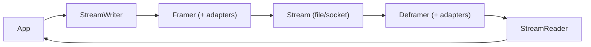
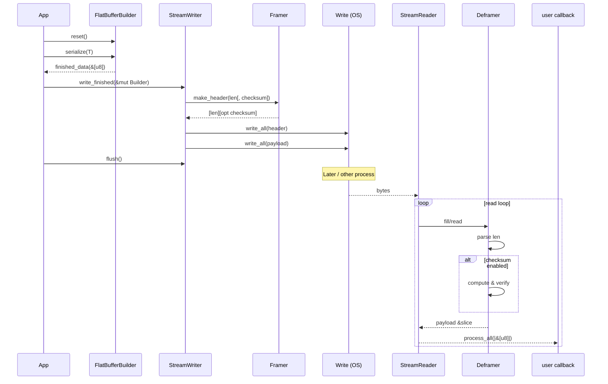

# FlatStream

A lightweight, zero-copy oriented, high-performance Rust library for encoding and decoding sequences of framed FlatBuffers messages.

FlatStream provides a trait-based architecture for efficiently writing and reading streams of FlatBuffers messages with a focus on maintaining zero-copy behavior. It originated from a high-frequency telemetry capture agent and has evolved into a general-purpose library for high-throughput, low-latency applications that persist and replay streams with predictable performance characteristics.

FlatStream is a small framing layer that adds stream boundaries and optional integrity to ordinary (non–size-prefixed) FlatBuffer payloads. Each frame is: 4-byte little-endian payload length, optional checksum, then payload bytes. The library does not change how FlatBuffers are encoded; it provides ergonomic streaming APIs (e.g., zero-copy reading via process_all()/messages()), configurable frame-length bounds, and composable adapters (checksums, bounds, observers). It integrates cleanly with standard Rust Read/Write and can be used over network transports (e.g., TCP), but networking has not been the primary focus of development or testing.

    Note on Performance: The performance figures and experimental results cited in the documentation were generated on a modern ARM-based MacBook Pro. Actual performance will vary based on the specific hardware and workload.

## TL;DR

FlatStream is a small framing layer around FlatBuffers for streams (files/sockets). It writes and reads sequences of messages with a minimal header and optional checksums, while preserving zero-copy access to each FlatBuffer payload as a `&[u8]`.

Two claims, scoped precisely: **"zero-copy" refers to payload access** — payloads are yielded as borrowed slices out of the reader's reusable buffer with no second payload copy or deserialization. A generic `Read` source copies each frame once into that buffer; growth may allocate, while warmed high-water-mark processing allocates nothing. A borrowed-slice/mmap source path, copy-free after the source is mapped, is planned. **Dispatch is static** on the framing/checksum/validation paths in their default configurations; deliberate exceptions when opted into: `MemoryPolicy` (one boxed call while it is consulted above its baseline; a gate-open benchmark measured ~1 ns over the no-policy path), `CompositeValidator` (one boxed call per composed validator; unmeasured), and `TypedValidator` (a function-pointer call).

## Wire format (at a glance)

```
[4-byte LE: payload length (u32)] [N-byte checksum (optional)] [FlatBuffer payload...]
```

- **checksum N**: the built-ins use 0, 2, 4, or 8 bytes; custom `Checksum`
  implementations may declare any exact width from 0 through 8 bytes.
- The payload is a normal FlatBuffer (not FlatBuffers’ internal size-prefixed variant).

## When to use / when not to use

- **Use FlatStream when**:
  - You need to write/read many FlatBuffers messages to a file or socket.
  - You want zero-copy access to message payloads as `&[u8]`.
  - You want composable adapters (bounds, checksums, observers, validators) without extra payload copies or steady-state allocations.

- **Probably not a fit when**:
  - You need a full RPC protocol, service discovery, or schema negotiation.
  - You require text/binary interop outside of FlatBuffers.

## Minimal end-to-end example

```rust
use flatbuffers::FlatBufferBuilder;
use flatstream::{DefaultDeframer, DefaultFramer, StreamReader, StreamWriter, Result};
use std::io::{BufReader, BufWriter, Cursor};

fn main() -> Result<()> {
    // Write one message
    let mut bytes = Vec::new();
    {
        let writer = BufWriter::new(Cursor::new(&mut bytes));
        let mut stream = StreamWriter::new(writer, DefaultFramer);
        let mut b = FlatBufferBuilder::new();
        let s = b.create_string("hello flatstream");
        b.finish(s, None);
        stream.write_finished(&mut b)?;
        stream.flush()?; // Flush the underlying writer; this is not an fsync.
    }

    // Read it back (payload provided as &[u8])
    let reader = BufReader::new(Cursor::new(bytes));
    let mut stream = StreamReader::new(reader, DefaultDeframer::new());
    stream.process_all(|payload| {
        println!("payload bytes: {}", payload.len());
        Ok(())
    })
}
```

## Architecture at a glance


```mermaid
graph LR
  App["App"] --> SW["StreamWriter<W,F>"]
  SW --> F["Framer (+ adapters)"]
  F --> Stream["Stream (file/socket)"]
  Stream --> D["Deframer (+ adapters)"]
  D --> SR["StreamReader<R,D>"]
  SR --> App
```


```mermaid
sequenceDiagram
  participant App
  participant Builder as FlatBufferBuilder
  participant Writer as StreamWriter
  participant Framer
  participant OS as Write (OS)
  App->>Builder: reset()
  App->>Builder: serialize(T)
  Builder-->>App: finished_data(&[u8])
  App->>Writer: write_finished(&mut Builder)
  Writer->>Framer: make_header(len[, checksum])
  Framer-->>Writer: [len][opt checksum]
  Writer->>OS: write_all(header)
  Writer->>OS: write_all(payload)
  App->>Writer: flush()
  Note over OS: Later / other process
  participant Reader as StreamReader
  participant Deframer
  participant User as user callback
  OS-->>Reader: bytes
  loop read loop
    Reader->>Deframer: fill/read
    Deframer->>Deframer: parse len
    alt checksum enabled
      Deframer->>Deframer: compute & verify
    end
    Deframer-->>Reader: payload &slice
    Reader-->>User: process_all(|&[u8]|)
  end
```

```
   StreamWriter             Framer (+ adapters)                 Stream
        |                         |                          [len][opt checksum][payload] ...
        v                         v                                   |
    FlatBuffer  --->  [len][checksum][payload]  --->  write            v

    read          <---  [len][checksum][payload]  <---  Deframer (+ adapters)  <---  StreamReader
                                      |
                                      v
                               payload: &[u8] (zero-copy)
```

## Core concepts (cheat sheet)

| Concept | What it is |
|---|---|
| `StreamWriter<W, F>` | Writes messages using a `Framer` to a `Write` impl |
| `StreamReader<R, D>` | Reads messages using a `Deframer` from a `Read` impl (yields `&[u8]`) |
| `Framer` | Defines how to encode `[len][opt checksum][payload]` |
| `Deframer` | Defines how to decode `[len][opt checksum][payload]` |
| `Checksum` | Pluggable integrity algorithm (e.g., `xxhash64`, `crc32`, `crc16`) |
| `BoundedFramer` / `max_frame_len` | Enforce max payload size on write / read (read defaults to the FlatBuffers maximum, 2 GiB; tighten with `with_max_frame_len`, or raise it toward the `u32` wire ceiling for raw non-FlatBuffer formats) |
| `Observer*` adapters | Invoke user callback with `&[u8]` slice (no allocation) |
| `Validating*` adapters | Ensure payload safety via the `Validator` trait |
| `MemoryPolicy` | Opt-in buffer reclamation for long-running processes (`with_memory_policy`) |

## Payload Validation

FlatStream includes an optional, composable validation layer that operates on both the write and read paths, checking payload validity at the stream boundary.

- **Why**: To prevent malformed data from ever being written to a stream, and to ensure generated FlatBuffers accessors only receive payloads that passed the configured verifier. The opt-in unchecked typed API remains explicitly `unsafe`.
- **How**: The `Validator` trait mirrors `Checksum`. You can add a validation layer with a fluent `.with_validator(...)` call on both framers (for writing) and deframers (for reading).
  - On write, validation runs *before* the payload is written.
  - On read, validation runs *after* the payload is deframed but *before* it is yielded to application code.
- **Zero-cost opt-out**: `NoValidator` provides a compile-time opt-out that is fully optimized away in release builds.

### Validator types

- `NoValidator`: Zero-cost, always succeeds.
- `TableRootValidator`: Uses FlatBuffers’ built-in verifier to check that a buffer is a valid table root and to enforce verifier limits (e.g., depth, table count). It does not validate schema-specific fields.
- `SizeValidator`: Size sanity checks (min/max bytes).
- `CompositeValidator`: Compose multiple validators (AND semantics) in order.
- `TypedValidator`: Schema-aware verification using a generated
  `root_as_*_with_opts` function, installed with `from_verify(...)` or
  `from_verify_named(...)`.

### Fluent API examples

```rust
use flatstream::{DefaultFramer, FramerExt, StreamWriter, TableRootValidator, Result};
use flatbuffers::FlatBufferBuilder;
use std::io::Cursor;

// Write path: prevent malformed data from ever being written.
let mut bytes = Vec::new();
let framer = DefaultFramer.with_validator(TableRootValidator::new());
let mut stream = StreamWriter::new(Cursor::new(&mut bytes), framer);

// This valid FlatBuffer payload (an empty table) will be written successfully.
let mut b = FlatBufferBuilder::new();
let start = b.start_table();
let table_root = b.end_table(start);
b.finish(table_root, None);
stream.write_finished(&mut b)?;

// Attempting to write a malformed payload would fail here with ErrorKind::ValidationFailed.
// For example: stream.write_payload(b"a string that is not a valid flatbuffer root")?;
```

```rust
use flatstream::{DefaultDeframer, DeframerExt, TableRootValidator};
use std::io::Cursor;

// Read path: structural safety before your code sees any payload.
let data: Vec<u8> = vec![]; // framed bytes
let deframer = DefaultDeframer::new().with_validator(TableRootValidator::new());
let mut reader = flatstream::StreamReader::new(Cursor::new(data), deframer);
reader.process_all(|payload| {
    // payload: &[u8] (in-place, zero-copy)
    Ok(())
})?;
```

```rust
use flatstream::{DefaultDeframer, DeframerExt, CompositeValidator, TableRootValidator, SizeValidator};

// Compose size + structural validation (AND semantics)
let validator = CompositeValidator::new()
    .add(SizeValidator::new(64, 1024 * 1024))
    .add(TableRootValidator::new());
let deframer = DefaultDeframer::new().with_validator(validator);
```

```rust
use flatstream::{DefaultDeframer, DeframerExt, TypedValidator};

// Example using the verifier generated for `my_schema::MyMessage`.
let validator = TypedValidator::from_verify_named("MyMessage", |opts, payload| {
    my_schema::root_as_my_message_with_opts(opts, payload).map(|_| ())
});
let deframer = DefaultDeframer::new().with_validator(validator);
```

### Error handling

Validation errors propagate as `ErrorKind::ValidationFailed { validator, reason }`. Checksum errors still occur first and propagate as `ErrorKind::ChecksumMismatch`.

### Performance

- `NoValidator` is zero-cost (fully optimized away in hot paths).
- Benchmarks: see `benches/validation_benchmarks.rs` for validation measurements.

## FAQ

- **Why not use FlatBuffers’ size-prefixed buffers?**
  - FlatStream already prefixes at the stream layer. Adding another 4-byte prefix inside the payload is redundant. Use `flatbuffers::root`/`root_with_opts` on the payload.

- **Is this zero-copy?**
  - For payload access, yes: the reader’s `process_all()`/`messages()` provide `&[u8]` borrowed from the internal buffer, and no intermediate copies are introduced by adapters. The `Read`-based source fills that buffer once per frame (see the scoping note in the TL;DR); a fully borrowed slice/mmap source path is planned.

- **How do I stop early?**
  - Use `messages()` and `break`, or return an `Err` from the `process_all` closure to halt. A lightweight “stop” enum could be added in the future.

- **Does this replace a protocol?**
  - No. It’s a framing layer for FlatBuffers payloads. RPC/routing/etc. are out of scope.

- **Does `flush()` make a file durable?**
  - No. `StreamWriter::flush()` delegates to `Write::flush()`. If durable storage is required, flush any buffering and apply the platform-appropriate durability operation (for example `File::sync_data`/`sync_all`) at the application’s chosen group-commit boundary. FlatStream deliberately does not choose that policy.

## Why FlatStream?

While FlatBuffers provides an efficient zero-copy serialization format, it does not specify a protocol or offer utilities for common streaming use cases. This typically requires developers to create custom solutions for message framing, memory management, and data integrity when writing sequences of messages.

Such recurring implementations can be inconsistent and may fail to adhere to zero-copy principles or leverage the most performant patterns of the FlatBuffers API.

### Origin

FlatStream was developed as a solution for a foundational use case: a high-frequency telemetry capture agent that required a durable, replayable stream format with minimal overhead. This application required capturing wide frames of mixed data types at sub-millisecond intervals, and FlatBuffers was selected for its efficiency and cross-platform compatibility.

The library's current architecture is the direct result of the performance-driven refactoring and experimentation required to optimize for this initial scenario. It encapsulates these validated, high-performance patterns into a general-purpose and composable library that provides a standardized framing layer for FlatBuffers in Rust.

## Architecture and Design Principles

FlatStream is designed around composability and zero-cost abstractions to solve common streaming challenges with a focus on zero-copy behavior and performance.

### Performance: No Library-Added Copies

Performance is achieved by maintaining the FlatBuffers zero-copy philosophy at every level the library controls (see the TL;DR for the precise scope).

- ***Writing:*** Both simple and expert modes pass builder.finished_data() to the `Write` target directly — the library adds no intermediate payload copy. (The target itself may stage bytes, e.g. `BufWriter`.)
- ***Reading:*** The StreamReader provides zero-copy *access* through its process_all() and messages() APIs, which deliver borrowed slices (&[u8]) directly from the internal read buffer; the `Read` source fills that buffer once per frame.
- **FlatBuffers Philosophy**: The serialized format IS the wire format, and in some cases a suitable final storage format. Unlike the proposed v2.5 design with its batching and type erasure, the current implementation maintains direct buffer-to-I/O paths and a convenience writer method with optimized, but not ultimate performance.
- **Benchmarking and Practical Testing**: Benchmarks and experimental script tests validate design choices with feature-gated Criterion benchmarks across configurations. Published figures come only from the in-repo Criterion benchmarks (see the comparative-benchmark section for machine and methodology).

FlatStream solves common streaming challenges by adhering to a few core principles:

### Composability and Static Dispatch

The library utilizes a trait-based Strategy Pattern to separate concerns:

- ***StreamSerialize:*** Defines how user data is serialized into the FlatBufferBuilder.
- ***Framer / Deframer:*** Defines the wire/file format (e.g., DefaultFramer or ChecksumFramer).
- ***Checksum:*** Defines the algorithm used for data integrity (e.g., XxHash64, Crc32).

The core types (`StreamWriter`/`StreamReader`) are generic over these traits. This allows the Rust compiler to use monomorphization, resulting in static dispatch in many cases and avoiding the overhead of dynamic dispatch (vtable lookups) on the critical path.

- ***Zero-Copy by Default:*** The library is designed to maintain FlatBuffers' zero-copy philosophy. `StreamReader` provides zero-copy *access* through borrowed slices (`&[u8]`): a generic `Read` source copies each frame once into the reusable buffer, and warmed steady-state processing adds no allocation, second payload copy, or deserialization.

- ***Pragmatic Performance:*** The StreamWriter offers two modes: a simple, convenient API for common use cases, and an expert-level API that provides fine-grained control over the FlatBufferBuilder lifecycle. This allows developers to avoid common performance pitfalls like memory bloat when dealing with mixed message sizes.

 

## Writing Modes: Simple vs Expert

FlatStream provides two modes for writing data, allowing you to choose based on your performance requirements:

### Simple Mode - Internal FlatBuffers Builder (Default)
Best for: Convenience, smaller number of messages per-stream and uniform/consistent message sizes

```rust
let mut writer = StreamWriter::new(file, DefaultFramer);
writer.write(&"Hello, world!")?;  // Internal builder management
```

- **Pros**: Zero configuration, automatic optimized builder reuse to avoid unnecessary heap allocations and memory copy operations, easy to use
- **Cons**: Single internal builder can cause memory bloat with mixed sizes due to the FlatBuffers default grow-downward allocator behavior
- **Performance**: Excellent for uniform messages; benchmark both modes with your serialization workload before choosing on speed alone

### Expert Mode - Self Managed FlatBuffers Builder(s)
Best for: Mixed message sizes, large messages, memory-constrained systems

```rust
let mut builder = FlatBufferBuilder::new();
let mut writer = StreamWriter::new(file, DefaultFramer);

// Self managed builder for zero-allocation writes
builder.reset();
event.serialize(&mut builder)?;
writer.write_finished(&mut builder)?;
```

- **Pros**: Multiple builders for different message types or size groups, better memory control, better performance for larger streams in length and message size
- **Cons**: More verbose, requires understanding of FlatBuffers
- **Performance**: Greater performance potential through improved memory control

> **📊 Copy Note**: Both simple and expert modes add no payload copy after serialization — the finished builder slice goes straight to the `Write` target. Expert mode is recommended when you need multiple builders for different message sizes to avoid memory bloat, not because it copies less.

### Understanding the Real Differences

The key differences between simple and expert mode are **NOT** about copying (both pass the finished slice directly):

1. **Memory Flexibility**: Expert mode allows multiple builders for different message sizes
2. **Builder Management**: The caller owns the reset/serialize step instead of paying for it inside `write()` (serialization dispatch is static in both modes)
3. **Memory Efficiency**: Avoid builder bloat when mixing large and small messages
4. **Builder Lifecycle Control**: Drop and recreate builders as needed for rare large messages

`StreamSerialize` is a generic bound, statically dispatched and monomorphized in simple mode. Both modes must perform serialization for changing messages; expert mode’s advantage is control over builder selection, sizing, reuse, and whether a payload can be prepared outside a latency-sensitive section. The in-repo “practical” benchmark intentionally pre-serializes the expert payload and is therefore an isolation experiment, not a general simple-mode overhead percentage.

## Installation

Add `flatstream` and the `flatbuffers` dependency to your `Cargo.toml`:

```toml
[dependencies]
flatbuffers = "25.9.23" # Use the appropriate version
flatstream = "0.2.7"
```

### Feature Flags

Data integrity checks (checksums) are optional and managed via feature flags.

- **`xxhash`**: Enables XXH3 (64-bit) checksum support. Highly recommended for high-performance integrity checks.
- **`crc32`**: Enables CRC32 checksum support.
- **`crc16`**: Enables CRC16 checksum support.
- **`all_checksums`**: Enables all available checksum algorithms for testing and development.
- **`unsafe_typed`**: Exposes the explicitly unsafe, verification-skipping
  typed read path for trusted-data benchmarks and specialized deployments.
- **`instruction_bench`**: Enables the Gungraun instruction-count benchmark;
  run it through `scripts/instruction_counts.sh`.

```toml
[dependencies]
# Example: Installing with XxHash support
flatstream = { version = "0.2.7", features = ["xxhash"] }
```

For comprehensive testing with all checksums enabled:
```bash
cargo test --features all_checksums
cargo bench --features all_checksums  # Run comprehensive benchmarks
```

## Verification (the local gate)

This project runs its full verification locally — there is no CI. The
scripts under `scripts/` cover everything a pipeline would, and each prints
what it checks and why:

```bash
scripts/gate.sh                  # fmt, clippy -D warnings, feature test matrix
                                 # (incl. unsafe_typed), rustdoc, bench/fuzz
                                 # compile checks, and an MSRV check against the
                                 # active toolchain (rust-version in Cargo.toml)
scripts/fuzz.sh [secs/target]    # manual local cargo-fuzz of the deframers
                                 # (rustup nightly if present, else a Docker
                                 # nightly container; no CI/scheduler)
scripts/miri.sh                  # manual Miri run over in-src unit tests
                                 # (rustup nightly if present, else Docker;
                                 # expand coverage when E2 adds slice/mmap paths)
scripts/instruction_counts.sh    # pinned-environment instruction counts
                                 # via Gungraun/Callgrind (valgrind/Linux; falls
                                 # back to a Docker container on macOS)
scripts/examples.sh              # run maintained non-mutating examples; several
                                 # assert their own
                                 # expected values (exact counts, measured
                                 # wire-format overhead), so this doubles as an
                                 # end-to-end behavioral proof
RUN_LOBSTER_INGEST=1 scripts/examples.sh
                                 # additionally regenerate the local LOBSTER
                                 # corpus when verified ZIPs are present
```

Run `gate.sh` and `examples.sh` before every review or tag. Run `fuzz.sh` manually
on a local machine after touching
framing, deframing, or checksum code — the deframer is the part of the
library that faces untrusted bytes. Run `instruction_counts.sh` when a
Criterion result looks like it moved but the machine is suspect: wall-clock
on a workstation swings several percent run-to-run, while instruction counts
are stable within one recorded compiler/dependency/target/tool environment.
Counts from different environments are not comparable. For wall-clock comparisons, use Criterion baselines
(`cargo bench --locked -- --save-baseline <name>`, later
`cargo bench --locked -- --baseline <name>`);
baselines live in `target/criterion` and are machine-local.

### Running the gate in a clean container

`gate.sh` uses whatever `rustc` is on `PATH`. To run it against a pinned Linux
toolchain at the exact MSRV — handy from a macOS workstation, and the closest
thing to a from-scratch CI run without adopting CI — use the official Rust image
whose tag matches `rust-version` in `Cargo.toml`. From the repo root:

```bash
docker run --rm \
  -v "$PWD":/opt -w /opt \
  -e CARGO_TARGET_DIR=/tmp/target \
  rust:1.97.1-bookworm \
  bash -c 'rustup component add rustfmt clippy >/dev/null 2>&1 || true; bash scripts/gate.sh'
```

Two details matter:

- **Pin the tag to `rust-version`** (`rust:1.97.1-bookworm`). The container's
  `rustc` then equals the declared MSRV, so every step runs on exactly the floor
  and the MSRV check reports `verified` instead of the "newer — floor not proven"
  note it prints on a newer toolchain.
- **Redirect `CARGO_TARGET_DIR` off the bind mount** (`/tmp/target`). The mount
  shares your working tree with the container; without the redirect, the
  container's Linux artifacts collide with the host's macOS `target/` (forcing a
  full rebuild in each direction) and drop root-owned files into the repo.

The `rustup component add` is a no-op on the full `-bookworm` image (it already
carries `rustfmt` and `clippy`); it keeps the command working on slimmer image
variants too.

The Docker fallback for instruction counts runs the trusted, short-lived
benchmark container with `seccomp=unconfined`, because Gungraun disables ASLR
with `setarch -R` and Docker's default profile blocks that syscall.

## Quick Start Example

### 1. Implementing StreamSerialize

Users must define how their data maps to a FlatBuffer builder by implementing the `StreamSerialize` trait.

```rust
use flatstream::{StreamSerialize, Result};
use flatbuffers::FlatBufferBuilder;

// Your application data structure
struct TelemetryData {
    timestamp: u64,
    label: String,
}

impl StreamSerialize for TelemetryData {
    fn serialize<A: flatbuffers::Allocator>(
        &self,
        builder: &mut FlatBufferBuilder<A>
    ) -> Result<()> {
        // In a real application, you would use your FlatBuffers generated code here.
        let label = builder.create_string(&self.label);
        // For this example, we just serialize the label.
        // builder.start_table();
        // builder.add_slot_scalar(field_offset, self.timestamp, 0);
        // builder.add_slot_offset(field_offset, label);
        // let offset = builder.end_table();

        // Crucial: You must call finish() within your serialize implementation.
        builder.finish(label, None);
        Ok(())
    }
}
```

### 2. Writing Data

Choose between simple mode (easy) or expert mode (fast) based on your needs:

#### Simple Mode
```rust
use flatstream::{StreamWriter, DefaultFramer, Result};
use std::io::BufWriter;
use std::fs::File;

// Assuming TelemetryData from the previous example
# struct TelemetryData { timestamp: u64, label: String };
# impl StreamSerialize for TelemetryData { fn serialize<A: flatbuffers::Allocator>(&self, builder: &mut FlatBufferBuilder<A>) -> Result<()> { Ok(()) } }

fn write_simple() -> Result<()> {
    let file = File::create("telemetry.bin")?;
    let writer = BufWriter::new(file);  // Always use buffered I/O!
    let mut stream_writer = StreamWriter::new(writer, DefaultFramer);

    let data = TelemetryData {
        timestamp: 1659373987,
        label: "temp_sensor_1".to_string(),
    };

    // Simple: The writer manages the builder internally.
    stream_writer.write(&data)?;
    stream_writer.flush()?;
    Ok(())
}
```

#### Expert Mode (Recommended for Production)
```rust
use flatbuffers::FlatBufferBuilder;
use flatstream::{StreamWriter, DefaultFramer, Result, StreamSerialize};
use std::io::BufWriter;
use std::fs::File;

// Assuming TelemetryData from the previous example
# struct TelemetryData { timestamp: u64, label: String };
# impl StreamSerialize for TelemetryData { fn serialize<A: flatbuffers::Allocator>(&self, builder: &mut FlatBufferBuilder<A>) -> Result<()> { let s = builder.create_string(&self.label); builder.finish(s, None); Ok(()) } }

fn write_expert() -> Result<()> {
    let file = File::create("telemetry_expert.bin")?;
    let writer = BufWriter::new(file);
    let mut stream_writer = StreamWriter::new(writer, DefaultFramer);

    // Manage builder externally for maximum performance.
    let mut builder = FlatBufferBuilder::new();

    let data = TelemetryData {
        timestamp: 1659373987,
        label: "temp_sensor_1".to_string(),
    };

    // Expert: Full control over builder lifecycle.
    builder.reset();  // Reuse allocated memory.
    data.serialize(&mut builder)?;
    stream_writer.write_finished(&mut builder)?;

    stream_writer.flush()?;
    Ok(())
}
```

#### Schema-typed expert-mode example

```rust
use flatbuffers::FlatBufferBuilder;
use flatstream::{StreamWriter, DefaultFramer, Result};
use std::io::BufWriter;
use std::fs::File;

// Replace `my_schema` and `Event` with your generated module and root table
fn write_typed() -> Result<()> {
    let file = File::create("telemetry_typed.bin")?;
    let writer = BufWriter::new(file);
    let mut stream_writer = StreamWriter::new(writer, DefaultFramer);

    let mut b = FlatBufferBuilder::new();
    b.reset();
    let label = b.create_string("temp_sensor_1");
    let event = my_schema::Event::create(
        &mut b,
        &my_schema::EventArgs {
            timestamp: 1659373987,
            label: Some(label),
            value: 42.0,
        },
    );
    b.finish(event, None);
    stream_writer.write_finished(&mut b)?;
    stream_writer.flush()?;
    Ok(())
}
```

### 3. Reading Data (Zero-Copy)

The `StreamReader` provides a high-performance `process_all` API for zero-copy access.

```rust
use flatstream::{StreamReader, DefaultDeframer, Result};
use std::io::Cursor;

fn read_data(data: Vec<u8>) -> Result<()> {
    let reader_backend = Cursor::new(data);
    let mut reader = StreamReader::new(reader_backend, DefaultDeframer::new());

    // High-performance, zero-copy processing using the process_all API.
    reader.process_all(|payload: &[u8]| {
        // 'payload' is a slice pointing directly to the FlatBuffer message
        // in the reader's internal buffer; access adds no second payload copy.
        println!("Read message of {} bytes.", payload.len());
        Ok(())
    })?;

    Ok(())
}
```

### Verifying FlatBuffers payloads (recommended)

Because the payload is a normal (non–size-prefixed) FlatBuffer, use the FlatBuffers verifier with `root_with_opts` to validate structure before accessing fields. Configure limits appropriate to your application. If you use size-prefixed FlatBuffers in other contexts, do not use size-prefixed verification here; FlatStream payloads are not size-prefixed.

#### Typed verification (preferred)

```rust
use flatstream::{
    DefaultDeframer, Error, Result, StreamDeserialize, StreamReader,
};
use std::io::Cursor;

struct MyMessageRoot;

impl<'a> StreamDeserialize<'a> for MyMessageRoot {
    type Root = my_schema::MyMessage<'a>;

    fn from_payload(payload: &'a [u8]) -> Result<Self::Root> {
        my_schema::root_as_my_message(payload).map_err(Error::from)
    }
}

fn read_typed(data: Vec<u8>) -> Result<()> {
    let mut reader = StreamReader::new(Cursor::new(data), DefaultDeframer::new());
    reader.process_typed::<MyMessageRoot, _>(|message| {
        // use `message` here
        Ok(())
    })
}
```

The feature-gated `process_typed_unchecked` variant skips verification and is
therefore an `unsafe` API: the caller must guarantee that every frame is valid
for the selected root type. Prefer the verified path unless a trusted-data
benchmark demonstrates that verification is material.

#### Generic verification (type-agnostic)

For type-agnostic checks, use FlatStream’s `TableRootValidator`, which internally
performs structural verification with `Verifier::visit_table(..)` (works without
any generated types):

```rust
use flatstream::{
    DefaultDeframer, DeframerExt, Result, StreamReader, TableRootValidator,
};
use std::io::Cursor;

fn read_structurally_valid(data: Vec<u8>) -> Result<()> {
    let deframer = DefaultDeframer::new().with_validator(TableRootValidator::new());
    let mut reader = StreamReader::new(Cursor::new(data), deframer);

    reader.process_all(|payload: &[u8]| {
        // payload has passed structural verification
        Ok(())
    })
}
```

### Hardening against malicious data

A frame's length prefix is attacker-controlled input: a corrupt or malicious header can declare an extremely large payload (e.g., 2 GB) and, without protection, the reader would try to allocate it — an Out-Of-Memory crash on demand.

Two constants define the envelope. `DEFAULT_MAX_FRAME_LEN` is the FlatBuffers maximum buffer size (2 GiB — bound to `flatbuffers::FLATBUFFERS_MAX_BUFFER_SIZE` by construction), so every valid FlatBuffer reads out of the box; `MAX_WIRE_FRAME_LEN` is the absolute framing ceiling the 4-byte `u32` length prefix can express (~4 GiB). Neither constrains file size — a stream may hold any number of maximum-size frames, and file-level offsets are `u64` values.

When reading from an untrusted source — or to enforce an operational limit — set an explicit ceiling with `with_max_frame_len`: frames declaring more than the configured limit are rejected with `ErrorKind::InvalidFrame` *before* any allocation is sized from the header. The check is a single integer compare. Raw or custom non-FlatBuffer framing may deliberately raise the bound up to `MAX_WIRE_FRAME_LEN`; the range above 2 GiB is never accepted by default.

```rust
use flatstream::{StreamReader, DefaultDeframer, Result};
use std::io::Cursor;

fn read_safely(data: Vec<u8>) -> Result<()> {
    const MAX_MESSAGE_SIZE: usize = 1_048_576; // 1 MiB

    let reader_backend = Cursor::new(data);
    let deframer = DefaultDeframer::new().with_max_frame_len(MAX_MESSAGE_SIZE); // Bound untrusted input
    let mut reader = StreamReader::new(reader_backend, deframer);

    reader.process_all(|payload: &[u8]| {
        // ... process payload ...
        Ok(())
    })?;

    Ok(())
}
```

### Crash recovery for journals

A journal that stopped mid-append — crash, kill, full disk — ends in a torn frame: a partial length header, checksum field, or payload. `recover_file()` makes the repair a contract instead of a convention: it seeks to the stream's start, scans with the same deframer normal reads use, and reports how many frames are intact, the exact absolute offset to truncate to, and how the scan ended.

```rust
use flatstream::{recover_file, DefaultDeframer, RecoveryEnd, Result};
use std::fs::OpenOptions;

fn reopen_journal(path: &str) -> Result<std::fs::File> {
    let mut file = OpenOptions::new().read(true).write(true).open(path)?;
    let report = recover_file(&mut file, DefaultDeframer::new())?;
    if report.end == RecoveryEnd::TornTail {
        file.set_len(report.last_good_offset)?; // drop the torn tail
    }
    // recover_file leaves the cursor at last_good_offset — the repaired end —
    // so the file is ready to hand to a StreamWriter to resume appending.
    Ok(file)
}
```

The contract is deliberately strict: **only `UnexpectedEof` — the crash-mid-append signature — is a torn tail** with a safe truncation point for an append-only journal whose expected failure mode is a crash during the final write. `ChecksumMismatch` is corruption inside a fully present frame (or a mismatched checksum configuration), `InvalidFrame` can mean a wrong format or a too-small configured bound, and `ValidationFailed` can mean validator drift — all of those return `Err` with the stop reason intact, because corruption and misconfiguration must never authorize truncating data a caller might still want. Run recovery with the deframer that matches the wire format (plain, matching checksum, no validators). Genuine device faults also return `Err`. The exhaustive truncation sweep in `tests/recovery_tests.rs` pins this behavior at every possible byte offset.

A complete but corrupted length header can still declare a large in-bounds payload before EOF is observed; a genuinely torn 1–3 byte length header is rejected before a length is parsed. Pass a deframer tightened with `with_max_frame_len` to the largest frame the application actually writes. Raw/custom journals that deliberately write frames above 2 GiB must use the same raised bound (up to `MAX_WIRE_FRAME_LEN`) for normal reads and recovery.

### Advanced: Manual Iteration Control

For cases requiring early termination or custom control flow:

```rust
let mut messages = reader.messages();
while let Some(payload) = messages.next()? {
    // Process message with zero-copy access
    if should_stop_early(payload) {
        break;
    }
}
```

## Advanced Usage

### Data Integrity (Checksums)

To protect against data corruption, use the `ChecksumFramer` and `ChecksumDeframer`. This requires enabling a checksum feature (e.g., `xxhash`).

Algorithm identities are pinned by known-answer tests (see `docs/WIRE_FORMAT_SPEC.md` §5): CRC-16/XMODEM, CRC-32/ISO-HDLC (the IEEE/zlib polynomial — **not** CRC-32C), and XXH3-64. Writer and reader must agree on the strategy out-of-band: reading a checksummed stream with the plain `DefaultDeframer` does **not** error — it silently mis-frames (the checksum bytes parse as payload). The corpus tests pin this behavior.

These are non-cryptographic checksums: they detect accidental corruption, not
malicious tampering. For an adversarial source, use an authenticated transport
or MAC in addition to the matching checksum deframer and schema validation.

```rust
#[cfg(feature = "xxhash")]
{
    use flatstream::{StreamWriter, ChecksumFramer, XxHash64, Result};
    use flatbuffers::FlatBufferBuilder;
    use std::io::{BufWriter, Cursor};

    fn write_protected() -> Result<()> {
        // 1. Define the checksum strategy (requires 'xxhash' feature)
        let checksum_alg = XxHash64::new();

        // 2. Create the framer
        let framer = ChecksumFramer::new(checksum_alg);

        // 3. Initialize the Writer with a buffer
        let mut buffer = Vec::new();
        let writer = BufWriter::new(Cursor::new(&mut buffer));
        let mut stream_writer = StreamWriter::new(writer, framer);

        // 4. Use the expert mode pattern to write a message
        let mut builder = FlatBufferBuilder::new();
        builder.reset();
        let offset = builder.create_string("A protected message");
        builder.finish(offset, None);
        stream_writer.write_finished(&mut builder)?;
        stream_writer.flush()?;
        
        Ok(())
    }
}
```

When reading, use the corresponding `ChecksumDeframer`. It will automatically validate the integrity and return `ErrorKind::ChecksumMismatch` if the data is corrupted.

### Sized Checksums

The library supports checksums of different sizes to optimize for different use cases:

Per-frame header overhead is the 4-byte length plus the checksum field (measured and asserted in `examples/sized_checksums_example.rs`):

- **CRC16 (2 bytes)**: 6-byte headers — 50% less framing overhead than XXH3-64's 12 bytes; suited to high-frequency small messages where header bytes dominate
- **CRC32 (4 bytes)**: 8-byte headers — 33% less framing overhead than XXH3-64
- **XXHash64 (8 bytes)**: 12-byte headers; the widest field and strongest collision resistance of the built-ins

Which to choose depends on your failure model (what corruption you expect and what a miss costs) at least as much as on payload size. All checksums are pluggable and composable.

### Adaptive Memory Management

For long-running applications handling mixed message sizes, `StreamWriter` and `StreamReader` support configurable memory reclamation via the `MemoryPolicy` trait.

By default, no policy is installed and the writer retains the largest buffer capacity seen. To prevent memory bloat after large message bursts, install an `AdaptiveWatermarkPolicy` to reset the internal builder once high capacity is no longer needed. The baseline capacity is policy configuration — a policy decides both *when* to reclaim and *what* to shrink back to. The policy is consulted once per message, and only while capacity exceeds its baseline; the machinery is outlined off the hot paths, so without a policy the residual cost is a predictable, never-taken branch.

```rust
use flatstream::{StreamWriter, DefaultFramer, AdaptiveWatermarkPolicy};

let policy = AdaptiveWatermarkPolicy::new(4, 5).with_baseline(16 * 1024);
let mut writer = StreamWriter::new(file, DefaultFramer).with_memory_policy(policy);
```

Policies apply to buffers the library owns — the writer's simple mode (`write()`) and the reader's internal buffer. In expert mode (`write_finished()`) you own the builder, so reclamation is your call. For custom allocators, see `with_memory_policy_and_factory`.

**Measured cost** (2026/07/23, Criterion, macOS/Apple Silicon, Rust 1.97.1,
sink writer, 100-byte messages; raw output in
`bench_results.memory_policy.txt`):

| Configuration | `write()` per message |
|---|---|
| No policy installed (default) | ~8.5 ns |
| No-op policy installed (boxed-call cost) | ~9.4 ns |
| `AdaptiveWatermarkPolicy` installed, not firing | ~10.9 ns |

The reclaim itself trades a bounded re-growth cost for footprint: in a worst-case oscillation benchmark (a 1 MB burst followed by 1,100 small messages, forcing a reclaim every cycle), the adaptive writer runs ~2.6× the CPU of an unbounded one (~1.17 ms vs ~0.45 ms per 10-cycle iteration) in exchange for dropping the steady-state footprint from 1 MB to the 16 KB baseline. Real workloads with rare bursts pay the re-growth once per burst, not continuously — and the baseline gate guarantees a policy can never thrash at steady state.

## Wire Format Specification

The format written to the stream is determined by the `Framer` implementation. FlatStream ensures all metadata (lengths and checksums) is written in Little Endian (LE) format to guarantee cross-platform consistency and interoperability.

### DefaultFramer Format

A simple, low-overhead format (4 bytes overhead).

```
[4 bytes LE: Payload Length (u32)] [Payload...]
```

### ChecksumFramer<T> Format

A robust format including data integrity validation. The overhead depends on the checksum algorithm (e.g., 4 bytes length + 8 bytes checksum for XxHash64).

```
[4 bytes LE: Payload Length (u32)] [N bytes LE: Checksum] [Payload...]
```

Where N is:
- 8 bytes for XXHash64 (u64)
- 4 bytes for CRC32 (u32)
- 2 bytes for CRC16 (u16)

## Performance Considerations

While FlatStream is optimized for high performance, achieving the lowest latency requires correct integration into your application architecture.

### Critical: I/O Buffering

`StreamWriter` and `StreamReader` operate directly on the underlying `W: Write` and `R: Read` types. They do not perform their own I/O buffering.

If you provide an unbuffered handle (like a raw `std::fs::File` or `std::net::TcpStream`), every write operation may result in a system call, significantly increasing latency and reducing throughput.

**Default recommendation**: Buffer file or network handles with `std::io::BufWriter`/`BufReader`, then measure. Buffering reduces small-write/read syscall pressure, but it adds staging; a future measure-gated vectored-write path may favor raw vector-capable sinks, while the planned slice/mmap reader avoids the `Read` path entirely.

```rust
use std::fs::File;
use std::io::BufWriter;
use flatstream::{StreamWriter, DefaultFramer};

let file = File::create("telemetry.bin").unwrap();

// WRONG: Unbuffered I/O, potentially slow due to excessive syscalls
// let writer = StreamWriter::new(file, DefaultFramer);

// CORRECT: Buffered I/O
let buffered_writer = BufWriter::new(file);
let writer = StreamWriter::new(buffered_writer, DefaultFramer);
```

### Synchronous I/O

This library currently uses synchronous I/O based on standard Rust `Read`/`Write` traits. In highly concurrent, low-latency capture agents, blocking the main capture thread for I/O is undesirable.

**Recommendation**: In the single-capture-thread design, offload the `StreamWriter` to a dedicated journal thread through a bounded SPSC queue/ring with explicit drop/backpressure policy. Use a multi-producer queue only when the application actually has multiple producers.

## Performance Guide

### Choosing the Right Mode

| Use Case | Recommended Mode | Reason |
|----------|------------------|---------|
| Learning/Prototyping | Simple (`write()`) | Easy to use, no setup |
| Uniform message sizes | Simple (`write()`) | Performance is nearly identical |
| Mixed message sizes | Expert (`write_finished()`) | Avoid memory bloat |
| Large messages (>1MB) | Expert (`write_finished()`) | Avoids internal-builder bloat; you control allocation |
| Memory-constrained systems | Expert (`write_finished()`) | Fine-grained memory control |
| Multiple message types | Expert (`write_finished()`) | Use separate builders per type |

### Expert Mode: Multiple Builders Pattern

When handling different message types or sizes, maintain separate builders:

```rust
// For a system handling control messages, telemetry, and file transfers
let mut control_builder = FlatBufferBuilder::new();     // Small, frequent
let mut telemetry_builder = FlatBufferBuilder::new();   // Medium, periodic  
let mut file_builder = FlatBufferBuilder::new();        // Huge, rare

// Use the appropriate builder for each message type
match message {
    Message::Control(msg) => {
        control_builder.reset();
        msg.serialize(&mut control_builder)?;
        writer.write_finished(&mut control_builder)?;
    }
    Message::Telemetry(msg) => {
        telemetry_builder.reset();
        msg.serialize(&mut telemetry_builder)?;
        writer.write_finished(&mut telemetry_builder)?;
    }
    Message::FileTransfer(msg) => {
        file_builder.reset();
        msg.serialize(&mut file_builder)?;
        writer.write_finished(&mut file_builder)?;
        // Could even drop file_builder here to free memory
    }
}
```

### Migration Path

Start with simple mode and migrate to expert mode when you need more control:

```rust
// Step 1: Start simple
writer.write(&event)?;

// Step 2: Profile and identify bottlenecks
// If write performance is limiting...

// Step 3: Migrate to expert mode
let mut builder = FlatBufferBuilder::new();
builder.reset();
event.serialize(&mut builder)?;
writer.write_finished(&mut builder)?;
```

### Performance Checklist

- [ ] **Always use buffered I/O** (`BufWriter`/`BufReader`)
- [ ] **Use expert for direct builder and memory management control** (`write_finished()`)
- [ ] **Reuse builders for most use cases** (call `reset()` not `new()`)
- [ ] **Consider custom allocators** for specialized memory management
- [ ] **Profile and/or benchmark before optimizing** (the simple mode might be enough!)

## Comparative benchmarks (current snapshot: 2026/07/23)

The following performance figures come from the Criterion comparative benchmarks in this repo (features `comparative_bench,all_checksums`; the latter enables the checksum variants), run on an ARM-based MacBook Pro with Rust 1.97.1. They reflect medians for the named groups. Results vary by hardware, toolchain, and workload.

### Simulated Telemetry Streams

Test description (for the info below):

- Data: a simple telemetry event consisting of three logical fields (`u64 device_id`, `u64 timestamp`, `f64 value`; 24 logical bytes). FlatStream stores those bytes inside a FlatBuffer vector, so the serialized payload is larger than 24 bytes.
- Stream format: `DefaultFramer` adds a 4-byte little-endian length prefix. Variants shown are default read and `xxhash64` checksum. (Earlier runs also measured an unsafe-read deframer variant; the alternate deframers were removed in the v0.2.7 hardening pass — the single safe read path hits the same steady state without `unsafe`.)
- Execution: in-memory buffers (`Vec<u8>`/`Cursor`), Criterion medians. Small dataset = 100 events; large dataset ≈ 100,000 events (~2.4 MiB of logical field data before FlatBuffer overhead).

- Small dataset (100 events):
  - flatstream_default: 3.0809 µs (~32.5M msgs/s)
  - flatstream_xxhash64: 3.3141 µs (~30.2M msgs/s)
  - bincode: 3.1772 µs (~31.5M msgs/s)
  - serde_json: 14.550 µs (~6.9M msgs/s)
  - Interpretation: these are different consumption models, not an equal-work speed ranking. Bincode/serde_json deserialize owned structs, while this FlatStream case stops after borrowed frame access without decoding fields. A generated-schema, fields-consumed variant is required before making application-level speed comparisons. Within FlatStream, the configured frame-length limit does not affect read throughput: the check is the same single integer compare on every frame regardless of the limit's value.

 - Large dataset (~2.4 MiB):
  - flatstream_default: 2.8732 ms (~34.8M msgs/s)
  - flatstream_xxhash64: 3.1146 ms (~32.1M msgs/s)
  - bincode: 2.8460 ms (~35.1M msgs/s)
  - serde_json: 13.645 ms (~7.3M msgs/s)
  - Interpretation: the same unequal-work caveat applies; these medians describe borrowed frame access versus owned deserialization and are not application-level speedups.

Test notes:

- These benches run entirely in memory using `Vec<u8>`/`Cursor`; they do not include filesystem or network effects. Figures are Criterion medians on the stated machine.
- Throughput is reported as messages per second, computed from medians and the number of messages per iteration. Byte throughput is intentionally omitted due to framing overhead variability.
- Minor variance across runs is expected (power/thermal state, background load).

Checksum configurations add predictable overhead relative to the default framer in these tests (small/large dataset):

- XXHash64: ~8%
- CRC32: ~19–20%
- CRC16: ~150–154%

Read path:

- The alternate deframer implementations (`UnsafeDeframer`, `SafeTakeDeframer`) were removed in the v0.2.7 hardening pass. The buffer is now a high-water mark that zeroes only on growth, so the steady-state read path performs no per-frame zeroing in fully safe code — the cost the variants existed to dodge no longer exists to pay.


### Simple streams (primitive types)

Brief test description:

- Data shapes: Minimal numeric (3×u64) and fixed string (16 ASCII bytes)
- Setup: 100 messages per iteration, in-memory buffers, Criterion medians
- Comparators: FlatStream borrowed frame access versus bincode/serde_json owned deserialization; all use a 4-byte length prefix, but the consumption work differs. Treat these as workflow medians, not equal-work rankings.

- Simple Streams (Numeric)/write_read_cycle_100 (messages/sec, median time):
  - flatstream_default: ~31.2M (3.2010 µs)
  - bincode: ~30.7M (3.2540 µs)
  - serde_json: ~10.2M (9.7996 µs)

- Simple Streams (String16)/write_read_cycle_100 (messages/sec, median time):
  - flatstream_default: ~45.9M (2.1778 µs)
  - bincode: ~20.0M (5.0011 µs)
  - serde_json: ~12.9M (7.7608 µs)

- Read-only deframer isolation (100 prewritten messages, messages/sec; median time):
  - Numeric: default ~202M (493.89 ns)
  - String16: default ~199M (502.50 ns)
  - Note: attribute changes only with a saved Criterion baseline from the same machine, toolchain, and dependency set; cross-snapshot wall-clock differences are not causal evidence.


## Benchmarking and updating performance figures

This project includes reproducible Criterion benchmarks for both realistic telemetry-style streams and simple primitive-type streams. Use the commands below to regenerate results and update the figures in this README.

Prerequisites:

- Run on AC power; close background tasks for consistent results.
- Optional: use a consistent toolchain and machine when updating snapshots.

Commands (write outputs to files):

```bash
# 1) Core suite (flatstream-only benches)
cargo bench --locked --bench benchmarks | tee bench_results.txt

# 2) Comparative suite (flatstream vs bincode/serde_json; all_checksums enables
#    the xxhash64/crc32/crc16 variants recorded in the results file)
cargo bench --locked --features comparative_bench,all_checksums --bench comparative_benchmarks | tee bench_results.comparative.txt

# 3) Simple streams suite (primitive types, plus read-only deframer isolation)
cargo bench --locked --features comparative_bench --bench simple_benchmarks | tee bench_results.simple.txt

# 4) Memory-policy overhead and reclamation trade-off
cargo bench --locked --bench memory_policy_benchmarks | tee bench_results.memory_policy.txt
```

Where to copy numbers from:

- Simulated Telemetry Streams (comparative_benchmarks)
  - In `bench_results.comparative.txt`, extract the median times for:
    - Small dataset (100 events): `flatstream_default`, `flatstream_xxhash64`, `bincode`, `serde_json`
  - Large dataset (~2.4 MiB): `flatstream_default`, `flatstream_xxhash64`, `bincode`, `serde_json`
  - Update the section “Comparative benchmarks (current snapshot: YYYY/MM/DD)” in this README and refresh the date.

- Simple streams (primitive types)
  - In `bench_results.simple.txt`, extract the median times for:
    - `Simple Streams (Numeric)/write_read_cycle_100/*`
    - `Simple Streams (String16)/write_read_cycle_100/*`
    - Read-only: `Simple Streams (Numeric)/read_only_100/*` and `Simple Streams (String16)/read_only_100/*`
  - Update the “Simple streams (primitive types)” section in this README.

- Memory policies
  - In `bench_results.memory_policy.txt`, extract `policy_overhead/*` and
    `oscillation_reclamation/*`.
  - Update the dated “Measured cost” snapshot in “Adaptive Memory Management.”

Converting medians to messages/sec (optional, shown in this README):

- For write_read_cycle_100: messages_per_sec ≈ 100 / median_seconds.
  - Example: 3.43 µs → 3.43e-6 s → 100 / 3.43e-6 ≈ 29.2M msgs/s
- For read_only_100: messages_per_sec ≈ 100 / median_seconds (same formula).

Notes:

- The medians printed by Criterion look like `[low mid high]`; use the middle value.
- This README intentionally reports messages/sec (not byte/s), because wire overhead differs with checksum options.

## Realistic dataset: LOBSTER (messages + orderbook)

This repository includes an optional workflow to benchmark and test against the LOBSTER sample data (message and orderbook streams) using FlatStream with FlatBuffers payloads.

- Data structure reference: `https://lobsterdata.com/info/DataStructure.php`.
- Location for ZIPs: `tests/corpus/lobster/zips/` (ignored by Git).
- Checksums of ZIPs: `tests/corpus/lobster/zips/SHASUMS.txt` (committable for provenance).
- Only ZIPs listed in `SHASUMS.txt` and passing SHA256 verification are processed. Subsets are allowed.

Schemas (committed):
- `examples/schemas/lobster_message.fbs` (Nx6 message rows; time is seconds [f64])
- `examples/schemas/lobster_orderbook.fbs` (Nx(4*L) orderbook rows; asks/bids as Level{price x10000, size})

Generated bindings (checked in):
- `examples/generated/lobster_message_generated.rs`
- `examples/generated/lobster_orderbook_generated.rs`

Ingestion example (reads ZIPs and emits FlatStream binaries):
- `examples/ingest_lobster.rs`
- Input: any `*_message_*.csv` and `*_orderbook_*.csv` inside each ZIP (all ZIPs are processed)
- Output (per ZIP): `tests/corpus/lobster/<file_base>-message.bin` and `...-orderbook.bin`
- Timestamp handling:
  - Message time is stored as seconds since midnight (f64), exactly as in LOBSTER.
  - Orderbook snapshot row k inherits time from message row k; if no pairing exists, the time is `0.0`.

Usage:
```bash
# Generate/refresh .bin streams from ZIPs
cargo run --example ingest_lobster --release --features lobster

# Run integration tests (iterate over all generated streams)
cargo test --test lobster_integration_test --features lobster

# Run LOBSTER benches (reports GiB/s and msgs/sec)
cargo bench --bench lobster_benchmark --features lobster
```

Verify checksums (optional but recommended):
```bash
# macOS
shasum -a 256 -c tests/corpus/lobster/zips/SHASUMS.txt
# Linux
sha256sum -c tests/corpus/lobster/zips/SHASUMS.txt
```

Benchmark reporting:
- Each generated file is benchmarked independently (all streams are included).
- Throughput is reported in two ways per file:
  - Bytes/sec via `Throughput::Bytes(total_bytes)` (GiB/s)
  - Messages/sec via `Throughput::Elements(num_messages)` (Melem/s, i.e., million messages per second)
- Example group names:
  - `LOBSTER Message <file>/read_full_stream`
  - `LOBSTER Message <file>/read_full_stream_msgs`
  - `LOBSTER Orderbook <file>/read_full_stream`
  - `LOBSTER Orderbook <file>/read_full_stream_msgs`

Notes:
- This path preserves FlatBuffers’ zero-copy semantics on reads: `StreamReader::process_all` yields `&[u8]`, deserialized with generated `root_as_*()` helpers.
- Timestamps follow the official LOBSTER representation (seconds with fractional precision) for apples-to-apples comparisons.
- The repository avoids build-time schema compilation; FlatBuffers bindings are checked in for reproducibility.

## Potential future considerations

The following settings may improve benchmark consistency and absolute performance. Evaluate on your hardware and workloads before adopting.

- Bench/release profiles (Cargo.toml):
  - [profile.bench]
    - opt-level = 3
    - lto = "thin"
    - codegen-units = 1
    - panic = "abort"
  - [profile.release]
    - opt-level = 3
    - lto = "thin"
    - codegen-units = 1
    - panic = "abort"

- Native CPU features for benches (create .cargo/config.toml):
  - [build]
    - rustflags = ["-C", "target-cpu=native"]

Notes:
- Panic=abort reduces binary size and eliminates unwinding cost, but consider your error reporting needs.
- target-cpu=native tailors codegen to the local machine; use with care if distributing binaries to other CPUs.
- lto and codegen-units=1 trade compile time for runtime performance; helpful for stable, infrequent releases.
