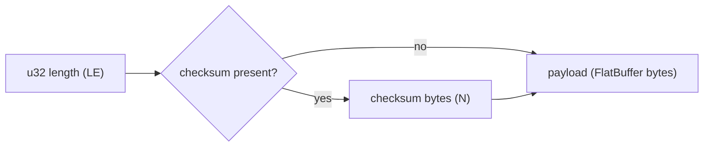
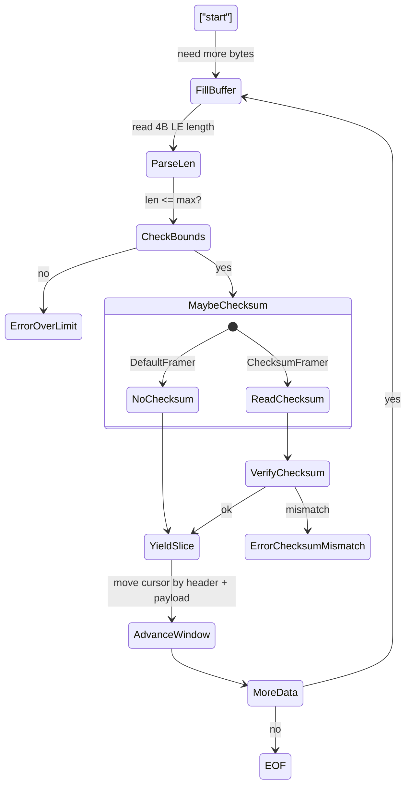

# Wire Format Specification: flatstream-rs

**Version:** 1.0  
**Status:** Implemented  
**Author:** Dallas Marlow  
**Date:** 2025-08-12

## 1. Overview

This document specifies the on-the-wire framing used by `flatstream-rs` and provides a compact, language-agnostic reference reader example to aid interoperability. The format is intentionally minimal: a 4-byte little-endian payload length, an optional checksum field, followed by a FlatBuffers payload.

## 2. Scope and Non-Goals

- Scope: Define binary layout, integer encodings, checksum sizes/coverage, error semantics, and a small reference reader example.
- Non-goals: This is not a general protocol. It does not define schemas, routing, negotiation, authentication, compression, or transport behavior beyond byte ordering and record boundaries.

## 3. Frame Layout (Binary)

```
[4-byte LE: payload length (u32)] [N-byte checksum (optional)] [payload bytes...]
```

- Payload length `L` is the exact number of bytes in the payload field (not including length or checksum).
- The payload is a normal FlatBuffer buffer (not FlatBuffers’ size-prefixed variant).
- All integers are encoded in little-endian (LE) byte order.



## 4. Field Encodings

- Length (4 bytes): Unsigned 32-bit little-endian value `L` (0 ≤ L ≤ 2^32-1).
- Checksum (N bytes, optional): Present only if the stream is configured to use a checksum. The algorithm is selected out-of-band by the application. The checksum is stored in exactly N bytes, little-endian.
- Payload (L bytes): A FlatBuffers buffer. The framing layer treats it as opaque bytes.

## 5. Checksum Algorithms

The writer and reader must agree out-of-band on one of the following algorithms. The checksum always covers the payload bytes only (the 4-byte length is not included in the calculation).

- 0 bytes: No checksum
- 2 bytes: CRC16 (XMODEM) — stored as `u16` LE
- 4 bytes: CRC32 (Castagnoli/implementation-compatible with `crc32fast`) — stored as `u32` LE
- 8 bytes: XXH3-64 — stored as `u64` LE

Notes:
- In the Rust implementation, the concrete algorithms are `Crc16` (XMODEM), `Crc32` (via `crc32fast`), and `XxHash64` (XXH3-64). Values are cast to `u64` internally but written with their exact on-wire width (2/4/8 bytes, little-endian).
- Additional algorithms may be added in future versions. Negotiation remains out-of-band.

## 6. Reader State Machine (Informative)

1. Read 4 bytes → `L` (u32 LE). On clean EOF here, signal end-of-stream; on partial read, signal `UnexpectedEof`.
2. If checksummed, read `N` checksum bytes → `C` (u16/u32/u64 LE depending on algorithm). Partial read → `UnexpectedEof`.
3. Read `L` payload bytes into a buffer. Partial read → `UnexpectedEof`.
4. If checksummed, compute `C' = checksum(payload)` and compare with `C` (after width truncation). Mismatch → `ChecksumMismatch`.
5. Yield `payload` to the caller. Repeat from step 1.



## 7. Error Semantics

- `UnexpectedEof`: Not enough bytes to complete length, checksum, or payload.
- `ChecksumMismatch`: Computed checksum over the payload does not equal the on-wire checksum.
- `InvalidFrame`: Payload length exceeds configured maximum or violates application constraints.

## 8. Interoperability Requirements

- Integer endianness is little-endian for all header fields.
- The checksum field width must match the configured algorithm exactly (2/4/8 bytes).
- The checksum covers only the payload bytes.
- The checksum algorithm is not self-describing; implementations must be initialized with the agreed algorithm before reading.
- Frames are concatenated with no separators. Clean EOF may only occur between frames.
- Implementations should enforce a maximum payload size before allocation to avoid resource exhaustion.

## 9. Reference Reader (Go, CRC32)

The following ~20-line Go function reads a single frame from a `bufio.Reader`. Set `withCRC32=false` to read a stream without checksums.

```go
package wirefmt
import ( "bufio"; "encoding/binary"; "hash/crc32"; "io" )
func ReadFrame(r *bufio.Reader, withCRC32 bool) ([]byte, error) {
    var lenLE [4]byte
    if _, err := io.ReadFull(r, lenLE[:]); err != nil { return nil, err }
    n := binary.LittleEndian.Uint32(lenLE[:])
    var exp uint32
    if withCRC32 {
        var c [4]byte
        if _, err := io.ReadFull(r, c[:]); err != nil { return nil, err }
        exp = binary.LittleEndian.Uint32(c[:])
    }
    buf := make([]byte, n)
    if _, err := io.ReadFull(r, buf); err != nil { return nil, err }
    if withCRC32 && crc32.ChecksumIEEE(buf) != exp { return nil, io.ErrUnexpectedEOF }
    return buf, nil
}
```

Adaptation notes:
- For CRC16, read/write 2 bytes (LE) and use an XMODEM polynomial implementation.
- For XXH3-64, read/write 8 bytes (LE) and use a XXH3-64 function.

## 10. Conformance Checklist

- [ ] Read 4-byte LE length and enforce a configured maximum before allocation
- [ ] Read exact checksum width (2/4/8) based on agreed algorithm
- [ ] Read exact `L` payload bytes
- [ ] Verify checksum over payload only (when enabled)
- [ ] Treat partial reads as `UnexpectedEof`
- [ ] Treat checksum failure as `ChecksumMismatch`
- [ ] Support clean EOF only between frames
- [ ] Do not assume FlatBuffers size-prefixed payloads

## 11. Security Considerations

- Length validation: Always bound `L` before reserving or allocating buffers.
- Denial-of-service: Reject frames exceeding reasonable application limits.
- Algorithm agility: Ensure both sides agree on algorithm and width; do not auto-detect from width alone unless strictly controlled.
- Payload validity: Use FlatBuffers’ verifier on the payload when needed; the framing layer provides integrity, not schema validation.

## 12. Versioning and Compatibility

- The current wire format is stable and backward-compatible for existing algorithms. New checksum algorithms can be added without changing the frame structure, provided both sides agree out-of-band.
- The on-wire representation of integers remains little-endian across platforms.

## 13. Appendix: Example Hex (Format-Level)

The framing layer treats payload as opaque bytes. The following example demonstrates the format only (payload is not a real FlatBuffer):

- No-checksum frame with payload `01 02 03` (length = 3):
  - Length (LE): `03 00 00 00`
  - Payload: `01 02 03`
  - Full frame: `03 00 00 00 01 02 03`

With CRC32 enabled, the frame inserts a 4-byte LE checksum between length and payload.

---

This document is intended to be sufficient for implementing compatible readers/writers in non-Rust languages. The normative reference is the Rust implementation in `src/framing.rs` and `src/checksum.rs`.


